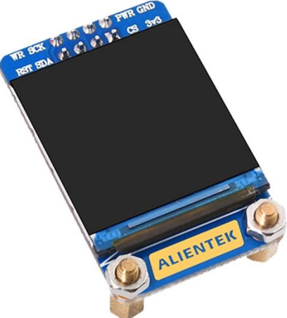
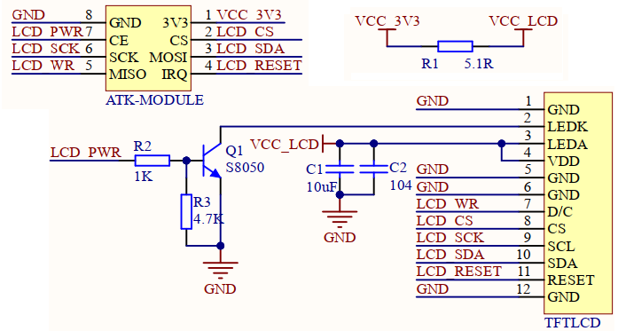

## 1 Introduction

### 1.1 Features
ATK-MD0130 module is a high-performance 1.3 inch LCD module launched by ALIENTEK. The resolution is as high as 240*240 pixels, supporting 16 bit true color display. The module uses ST7789V as the LCD driver chip. The chip is equipped with RAM, without external driver or memory, and the external main control chip only needs SPI interface to light easily drive ATK-MD0130 module.

### 1.2 Parameter

Here are the product basic parameters: 
| Parameter                  | Describe                           |
| -------------------------- | ---------------------------------- |
| Communication Interface    | Four-wire SPI                      |
| Color Format               | RGB565                             |
| Color Depth                | 16-bit                             |
| LCD Driver chip            | ST7789V                            |
| LCD Resolution             | 240 * 240                          |
| Screen Size                | 1.3 inch                           |
| Display Area               | 23.4mm * 23.4mm                    |
| View Direction             | Full viewing Angle                 |
| Operating Temperature      | -20℃ ~ 70℃                       |
| Storage Temperature        | -30℃ ~ 80℃                       |
| Mudule Size                | 41.5mm * 26.3mm                    |

The electrical parameters are shown in the following table:

| Parameter                  | Describe                           |
| -------------------------- | ---------------------------------- |        
| Supply voltage             | 3.3V                               |
| IO port level              | 3.3V                               |
| Power dissipation          | 50mA(max)                          |
| V<OH>                      | 2.64V(Min)                         |
| V<OL>                      | 0.66V(Max)                         |
| V<IH>                      | 2.64V(Min)                         |
| V<IL>                      | 0.66V(Max)                         |

### 1.3 Appearence

The ATK-MD0130 module looks like this:

### 1.4 Interface

The ATK-MD0130 module is connected to the outside through a 2*4 row needle (2.54mm spacing). The module can be directly connected to the ALIENTEK Warship STM32F103 development board and ALIENTEK MiniSTM32H750 development board and other development boards with WIRELESS interface (SPI interface), and for the development board without on-board WIRELESS interface, it can be connected through the dupont line.

The ATK-MD0130 module is connected to the external circuit through a 2*4 row pin (2.54mm spacing). The detailed description as shown in the table below.

| Number    | Name         | Describe                                                                |
| --------- |------------- | -----------------------------------------------------------             |
| 1         | 3V3          | 3V3 power supply                                                        |
| 2         | CS           | SPI communication chip selection signal (effective low level)           |
| 3         | SDA          | SPI communication MOSI signal line                                      |
| 4         | RST          | Hardware reset pin (low level valid)                                    |
| 5         | WR           | Write command/data signal line (low: write command; High: Write data)   |
| 6         | SCK          | SPI communication SCK signal line                                       |
| 7         | PWR          | LCD backlight control pin (low: off; High level: On)                    |
| 8         | GND          | Power ground                                                            |

## 2 Schematic

The schematic diagram of the ATK-MD0130 module is shown as follows.

